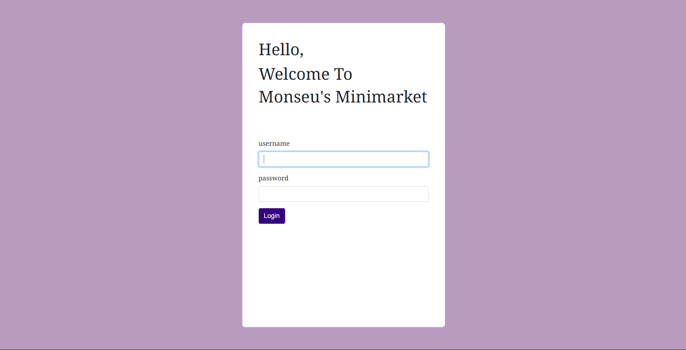
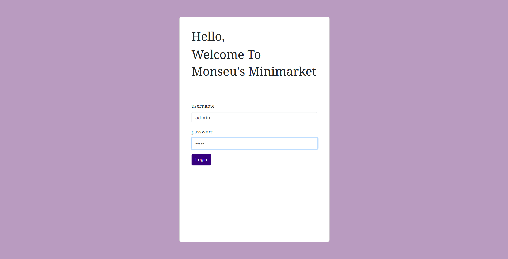

# MONSEU'S MINIMARKET INVENTORY PROJECT PROGRESS
Berikut adalah laporan mengenai perkembangan pengerjaan projek kami per-tanggal **14 April 2025.**

## EJS
Kami telah membuat EJS untuk halaman log in seperti berikut.
* Halaman Log In

Pada halaman ini sudah bisa memasukkan username Admin dan password Admin.

* Memasukkan username dan password

* Halaman Home

Ini adalah halaman log in, menggunakan tema warna yang kami tentukan yaitu ungu yang merupakan warna identitas kelompok kami. Kami gunakan kode CSS langsung pada file EJS.

## Halaman Home
Kami juga telah membuat halaman Home dan Stok untuk Admin yang dapat menambahkan stok produk dan juga menambahkan produk baru pada etalase.

Namun sayangnya karena kesalahan teknis, file tersebut terhapus dan tidak bisa dikembalikan lagi.

## Rencana Selanjutnya
Pada tahap berikutnya, kelompok kami akan kembali membuat halaman Home dan Stok untuk Admin yang terhapus dan  juga membuat halaman Home untuk Pembeli.

Kami juga berniat memisah file EJS dengan CSS agar lebih tertata rapi dan mudah disunting.
